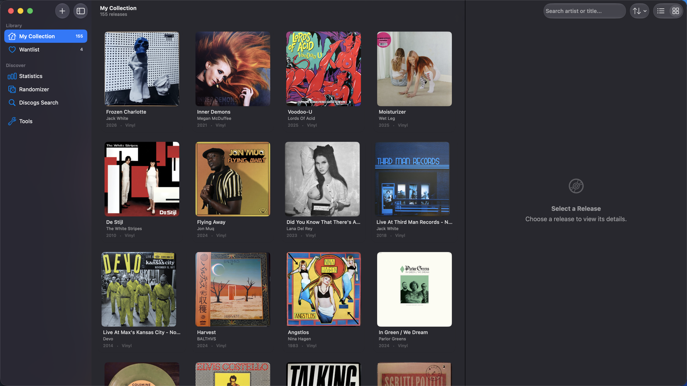
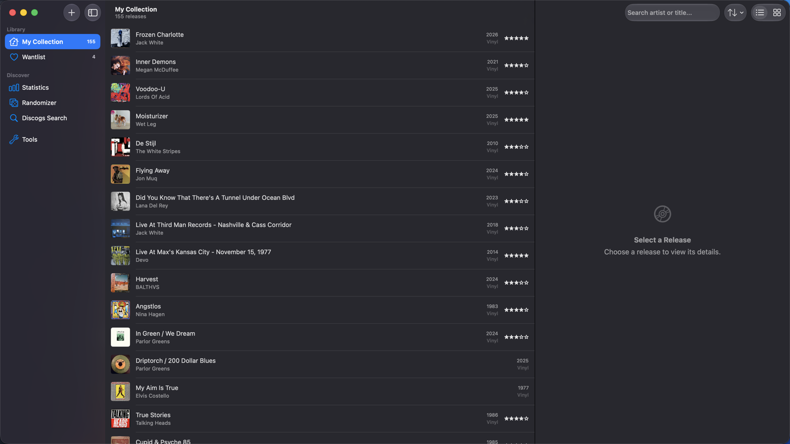
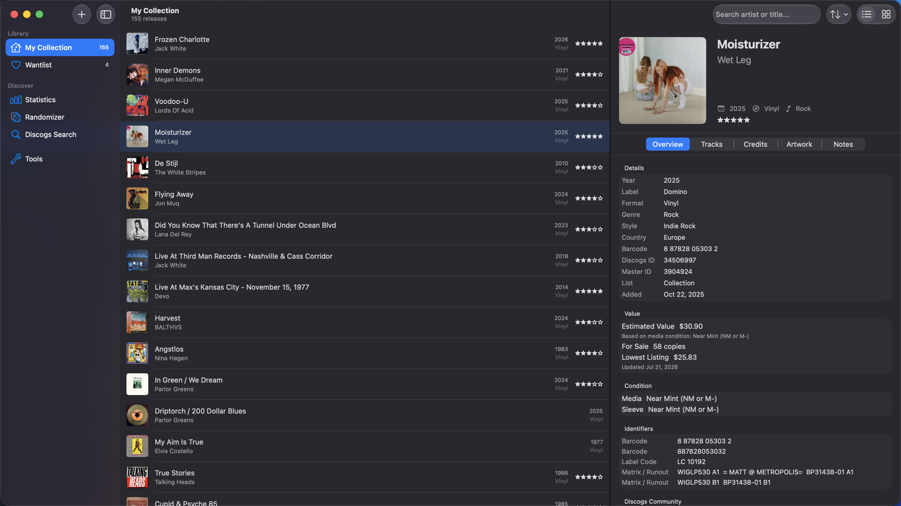
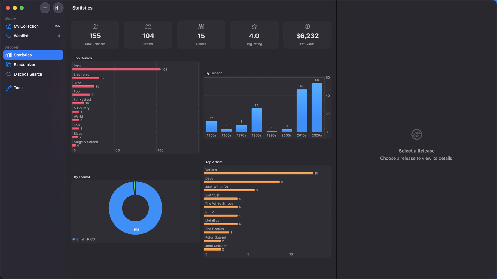
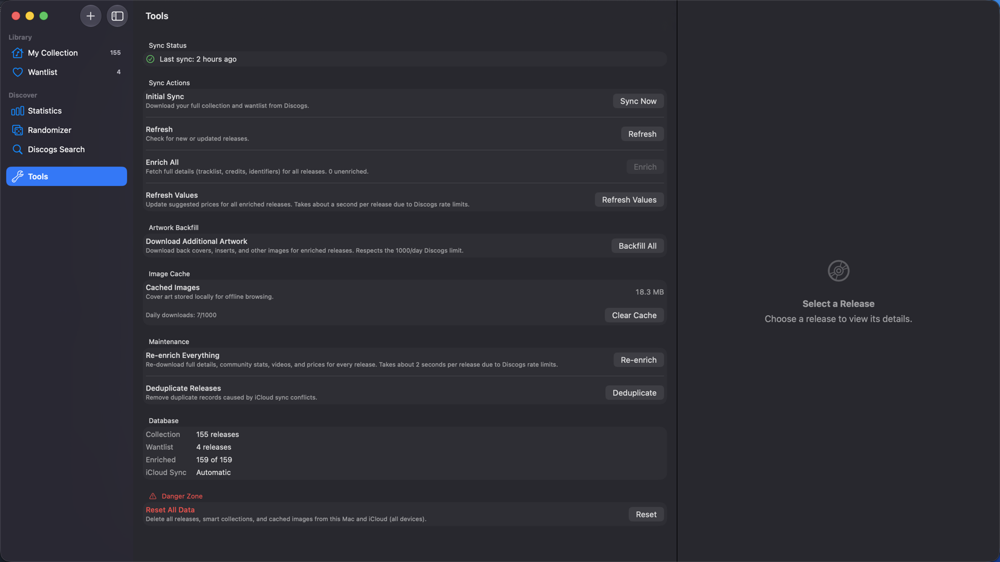

# Vinyl Crate

A native macOS app for managing your vinyl (and other format) record collection, powered by the Discogs API with Apple Music integration, collection value tracking, and full iCloud sync.



## Features

### Collection Management

- **Discogs Sync** — Import your full collection and wantlist from Discogs, with incremental refresh
- **Two-Way Sync** — Push ratings, media/sleeve conditions, and personal notes back to Discogs; removing a release in the app also removes it from your Discogs collection or wantlist
- **Enrichment** — Fetch detailed metadata including tracklists, credits, identifiers, country, master release ID, and additional artwork
- **List & Grid Views** — Browse as a detailed list or an artwork grid, with per-list sort orders (date added, year, artist, title, rating)
- **Smart Collections** — Save search queries as dynamic collections with live counts
- **Advanced Search** — Query syntax with field prefixes, quoted phrases, year/rating ranges
- **Discogs Search** — Search the Discogs database and add releases to your collection or wantlist



### Values & Market Data

- **Per-Release Values** — Condition-graded price suggestions from the Discogs marketplace, matched to each record's media condition
- **Sensible Fallbacks** — Ungraded records are valued at VG+ (the collector convention), clearly labeled as an estimate; releases with no sales history fall back to the lowest current listing
- **Collection Value** — Total estimated value of your collection on the Statistics dashboard
- **Community Stats** — How many Discogs users have and want each release, plus the community rating
- **Videos** — Linked videos (typically YouTube) for each release, straight from Discogs



### Insights & Discovery

- **Statistics** — Total releases, artists, genres, average rating, and estimated value, with charts for genres, decades, formats, and top artists (Swift Charts)
- **Randomizer** — "Surprise Me" picks a random album from your collection
- **Apple Music Integration** — Match releases to Apple Music and play albums directly in the app



### System Integration

- **Siri & Shortcuts** — Six App Intents: Surprise Me, Open Record, Find Records, Add to Wantlist, Play Record, and Collection Stats
- **Spotlight** — Every release is indexed; search your collection from anywhere on your Mac
- **iCloud Sync** — Core Data + CloudKit keeps your library in sync across all your Macs
- **VoiceOver** — Rows, cards, ratings, and stats are fully labeled for screen readers

### Maintenance Tools

- **Refresh Values** — Re-fetch price data for every enriched release
- **Re-enrich Everything** — Rebuild all enrichment data (details, community stats, videos, prices) from scratch
- **Artwork Backfill** — Download all additional artwork (back covers, inserts, etc.), respecting the 1000/day Discogs limit
- **Deduplicate** — Remove duplicate records caused by iCloud sync conflicts



## How Values Work

Each release's estimated value is chosen in order of confidence:

1. **Graded** — If the record has a media condition set, the value is the Discogs suggested price for exactly that grade.
2. **Ungraded** — Without a condition, the value assumes Very Good Plus (VG+) and says so in the UI. Grade the record and the value snaps to the right number instantly — all grades are stored locally.
3. **No sales history** — Releases Discogs can't price fall back to the cheapest copy currently listed, labeled as such.

Values are estimates based on media condition only (sleeve condition isn't factored — the Discogs API doesn't offer it), and they go stale; run **Tools → Refresh Values** periodically to update them.

> **Note:** Price suggestions require a Discogs account with seller settings enabled. Without one, values fall back to lowest-listing prices only.

## Requirements

- macOS 15.0+
- Xcode 16+
- A [Discogs](https://www.discogs.com) account with a [personal access token](https://www.discogs.com/settings/developers)
- Discogs seller settings enabled (optional, for condition-graded value estimates)
- Apple Music subscription (optional, for playback features)

## Setup

1. Clone the repository
2. Open `wax_log.xcodeproj` in Xcode
3. In Signing & Capabilities:
   - Set your development team
   - Ensure **CloudKit** is enabled with container `iCloud.waxlog`
   - Enable **MusicKit** on your App ID at [developer.apple.com](https://developer.apple.com/account/resources/identifiers/list)
4. Build and run
5. Go to **Settings** in the sidebar, enter your Discogs username and personal access token
6. Go to **Tools** and click **Sync Now** to import your collection
7. Click **Enrich** to fetch full details and values for every release (about 2 seconds per release)

Already had your library enriched before values existed? Run **Tools → Re-enrich Everything** once to backfill prices, community stats, and videos.

## Architecture

- **SwiftUI** with `NavigationSplitView` (sidebar / content / detail)
- **Core Data** with `NSPersistentCloudKitContainer` for local-first storage + iCloud sync
- **Swift Concurrency** — actors for thread-safe networking and image caching
- **App Intents** for Siri, Shortcuts, and Spotlight integration
- **MusicKit** for Apple Music catalog search and playback
- **Swift Charts** for the statistics dashboard
- **Swift Testing** for the unit test suite

### Project Structure

```
wax_log/
├── Intents/
│   ├── ReleaseEntity.swift       # App Intents entity for releases
│   └── VinylCrateIntents.swift   # Siri / Shortcuts intents
├── Models/
│   ├── CollectionStats.swift     # Shared stats (dashboard + intents)
│   └── Release+Extensions.swift  # Decoded JSON fields, estimated value
├── Persistence/
│   └── PersistenceController.swift
├── Services/
│   ├── AppleMusicService.swift
│   ├── DiscogsClient.swift       # Discogs REST client (actor)
│   ├── ImageCacheService.swift
│   ├── KeychainService.swift
│   ├── SearchService.swift
│   └── SyncService.swift         # Sync, enrichment, values, removal
├── Views/
│   ├── Collection/          # List, grid, cards, detail, randomizer
│   ├── Detail/              # Tracks, credits, artwork, notes tabs
│   ├── Search/              # Discogs search, advanced search
│   ├── Settings/            # Credentials & preferences
│   ├── Sidebar/             # Smart collection management
│   ├── Statistics/          # Charts dashboard
│   └── Tools/               # Sync controls & maintenance
├── WaxLog.xcdatamodeld      # Core Data schema
├── ContentView.swift         # Main navigation
└── wax_logApp.swift          # App entry point

wax_logTests/                 # Swift Testing unit tests
```

## Testing

Run the unit tests in Xcode with **⌘U**, or from the command line:

```sh
xcodebuild test -project wax_log.xcodeproj -scheme wax_log | xcbeautify
```

The suite covers value-basis selection, stats aggregation, search query parsing, display formatting, and App Intents entity mapping — all against an in-memory Core Data store.

## Discogs API Usage

This app respects Discogs API guidelines:

- 1 request/second rate limiting with exponential backoff on 429 responses
- Enrichment makes two requests per release (release detail + price suggestions)
- 1000 image downloads per day cap
- Proper `User-Agent` header identification

## License

MIT
